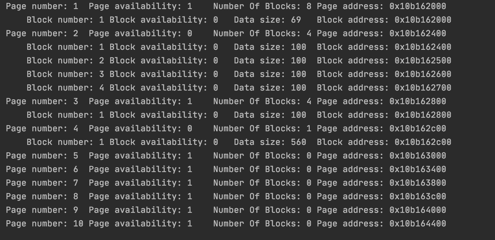
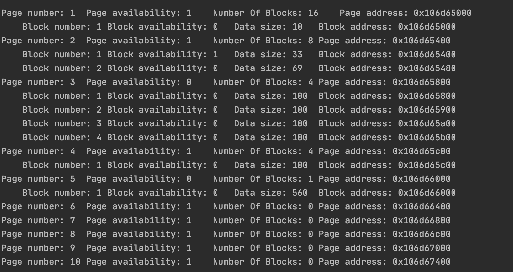
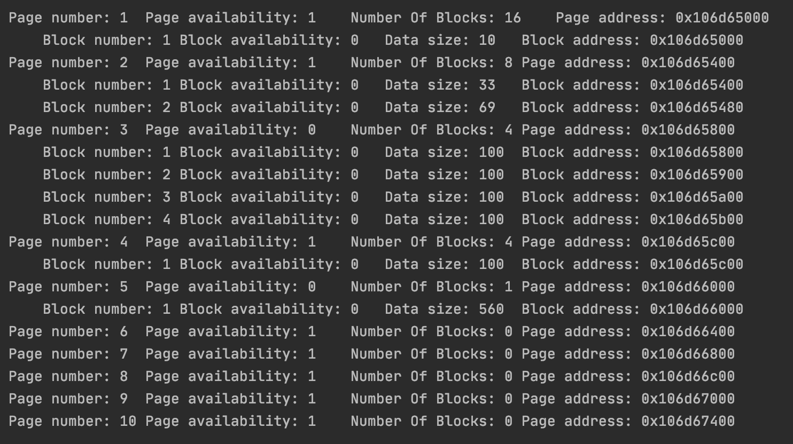

# page-allocator
### Basic Options
- PAGE_SIZE 4096 or 4kb
- MEMORY_SIZE 16384 or 16kb, thus 4 pages can be created using this memory
- MIN_CLASS_SIZE 16 or 2^4, next classes are 2^x where x >= 4
- BLOCK_HEADER_SIZE 1, the byte used to define whether block is free or busy
### Page Header Description
#### Status
- Free, if page doesn't contain any allocated memory
- Divided, if size of the allocated memory is less or equal than PAGE_SIZE / 2
- MultipageBlock, if size of the allocated memory is grater than PAGE_SIZE / 2
#### ClassSize
- Used to indicate how much memory each block of the page has
- It comes out that the page can contain PAGE_SIZE / ClassSize blocks
#### AvailableBlock
- In case of divided status it points on a free block
- In case of multipage block status it points on the next page block
- In case of free status it has nullptr value
### Algorithm description
#### `void* mem_alloc(size_t size)` function
This function align `size` to a minimum power of two equivalent. In case when `size <= PAGE_SIZE / 2`, the function searches the classified page with the same class size. If such page is not found, the function searches for a free page and divide it into blocks with an appropriate size, initialize their headers and changes the header, setting divided status, class size and available block pointer. The function returns `nullptr` if no free pages found. In case when `size > PAGE_SIZE / 2`, the function calculates amount of pages needed to store such a big block. If amount of free pages is greater or equal to amount of pages needed, then the function changes the header, setting multipage block status, class size equal to alinged block size, available block pointer equal to the next page's block. If there are not enough free pages, then `nullptr` is returned. In case of a successful allocation the address of the new block is returned.
#### `void mem_free(void* addr)` function
This function finds a page which contains the `addr` and checks if `addr` is valid. In case when page status is divided, then the function sets `addr` block free and checks if every block free, if so, the function changes the header and adds the page to free pages array. Also, the function checks whether the page was full, then the function adds the page to the available classified pages array. In case when page status is multipage block, then the function changes headers of all pages containing `addr` block to free status.
#### `void* mem_realloc(void* addr, size_t size)` function
This function checks if `addr` is valid and align `size` to a minimum of two equivalent. The functions searches the page that contains a block with address equal to `addr`. In case when page status is divided, the function calls `mem_alloc(size)` method and calls `mem_free(addr)` on allocation success. The function returns `addr` if allocation failed. In case when page status is multi page block, the function calculates amount of pages needed to allocate a new block with size equal to `size`. If old and new amount of pages are equal then `addr` is returned. If `size >= PAGE_SIZE / 2` then the function calls `mem_free(addr)` and then calls `mem_alloc(size)` and return the allocation result. If old amount of pages is greater than new one, then the function sets the excess pages free and changes size of the remaining pages. If new amount of pages is greater than old one, then the function changes the class size of the current multi block pages and allocate free pages needed.
### Examples
#### Example of `mem_alloc(size_t size)` function
##### Description
Allocation 10 33 69 100 100 100 100 100 560

##### Code
```
    page_malloc(10);


    void* test = page_malloc(33);

    page_malloc(69);
    page_malloc(100);
    page_malloc(100);
    page_malloc(100);
    page_malloc(100);
    page_malloc(100);
    page_malloc(560);
```
##### Picture

#### Example of `mem_free(void* addr)` function
##### Description
Free block test
##### Code
`page_free(test);`
##### Picture


#### Example of `mem_alloc(void* addr, size_t size)` function
##### Description
Realloc
##### Code
``
page_realloc(33);
``
##### Picture

