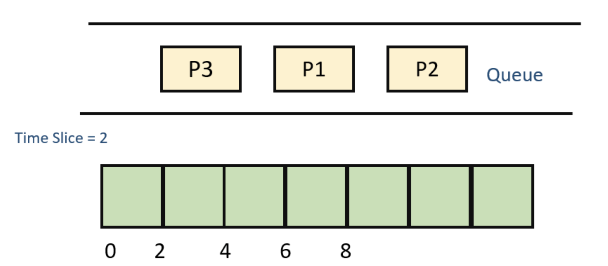
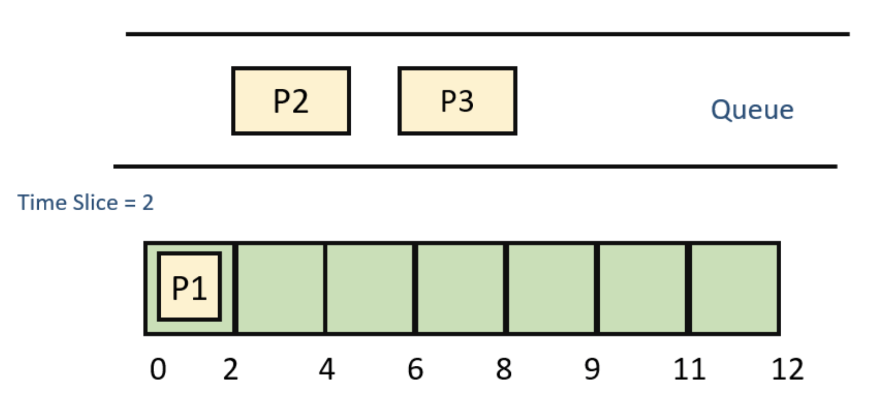
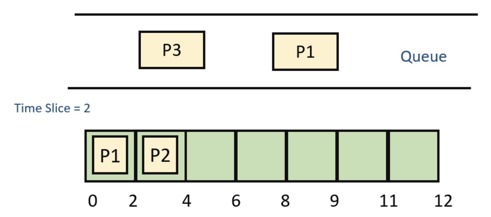
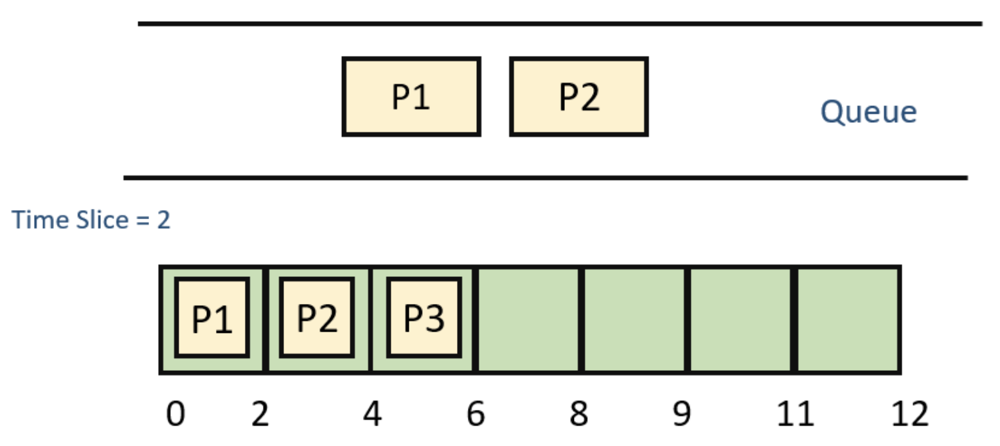
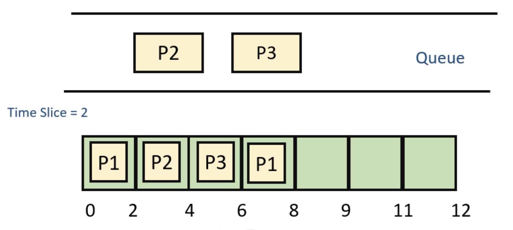
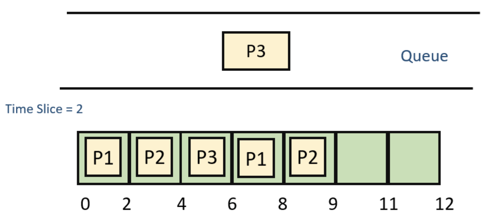
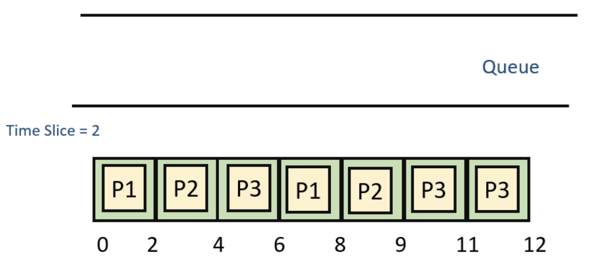

# Round Robin Scheduling Algorithm
### What is Round-Robin Scheduling?
The name of this algorithm comes from the round-robin principle, where each person gets an equal share of something in turns. It is the oldest, simplest scheduling algorithm, which is mostly used for multitasking.

In Round-robin scheduling, each ready task runs turn by turn only in a cyclic queue for a limited time slice. This algorithm also offers starvation free execution of processes.
### Characteristics of Round-Robin Scheduling
Here are the important characteristics of Round-Robin Scheduling:

* Round robin is a pre-emptive algorithm
* The CPU is shifted to the next process after fixed interval time, which is called time quantum/time slice.
* The process that is preempted is added to the end of the queue.
* Round robin is a hybrid model which is clock-driven
* Time slice should be minimum, which is assigned for a specific task that needs to be processed. However, it may differ OS to OS.
* It is a real time algorithm which responds to the event within a specific time limit.
* Round robin is one of the oldest, fairest, and easiest algorithm.
* Widely used scheduling method in traditional OS.
### Example of Round-robin Scheduling
| Process Queue | Burst time | 
| :--- | ---: |
| P1 | 4 |
| P2 | 3 |
| P3 | 5 |

**Step 1)** The execution begins with process P1, which has burst time 4. Here, every process executes for 2 seconds. P2 and P3 are still in the waiting queue.

**Step 2)** At time =2, P1 is added to the end of the Queue and P2 starts executing

**Step 3)** At time=4 , P2 is preempted and add at the end of the queue. P3 starts executing.

**Step 4)** At time=6 , P3 is preempted and add at the end of the queue. P1 starts executing.

**Step 5)** At time=8 , P1 has a burst time of 4. It has completed execution. P2 starts execution

**Step 6)** P2 has a burst time of 3. It has already executed for 2 interval. At time=9, P2 completes execution. Then, P3 starts execution till it completes.

**Step 7)** Let's calculate the average waiting time for above example.
**Wait time**
```
P1= 0+ 4= 4
P2= 2+4= 6
P3= 4+3= 7
```
### Advantage of Round-robin Scheduling
Here, are pros/benefits of Round-robin scheduling method:

* It doesn't face the issues of starvation or convoy effect.
* All the jobs get a fair allocation of CPU.
* It deals with all process without any priority
* If you know the total number of processes on the run queue, then you can also assume the worst-case response time for the same process.
* This scheduling method does not depend upon burst time. That's why it is easily implementable on the system.
* Once a process is executed for a specific set of the period, the process is preempted, and another process executes for that given time period.
* Allows OS to use the Context switching method to save states of preempted processes.
* It gives the best performance in terms of average response time.
### Disadvantages of Round-robin Scheduling
Here, are drawbacks/cons of using Round-robin scheduling:

* If slicing time of OS is low, the processor output will be reduced.
* This method spends more time on context switching
* Its performance heavily depends on time quantum.
* Priorities cannot be set for the processes.
* Round-robin scheduling doesn't give special priority to more important tasks.
* Decreases comprehension
* Lower time quantum results in higher the context switching overhead in the system.
* Finding a correct time quantum is a quite difficult task in this system.

