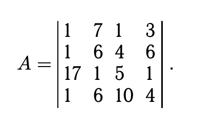
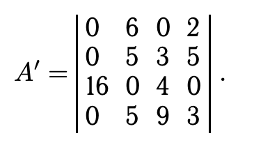
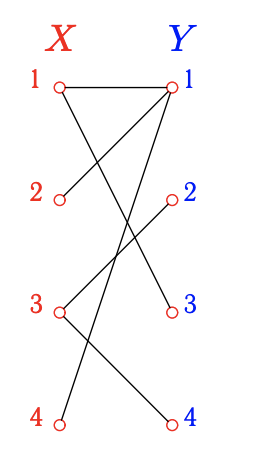
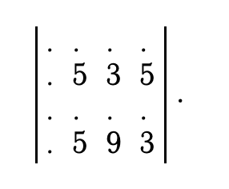
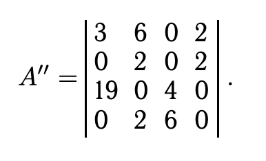
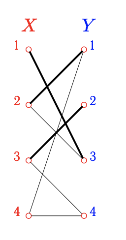
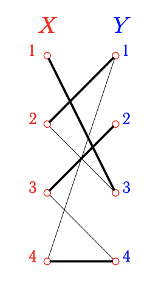
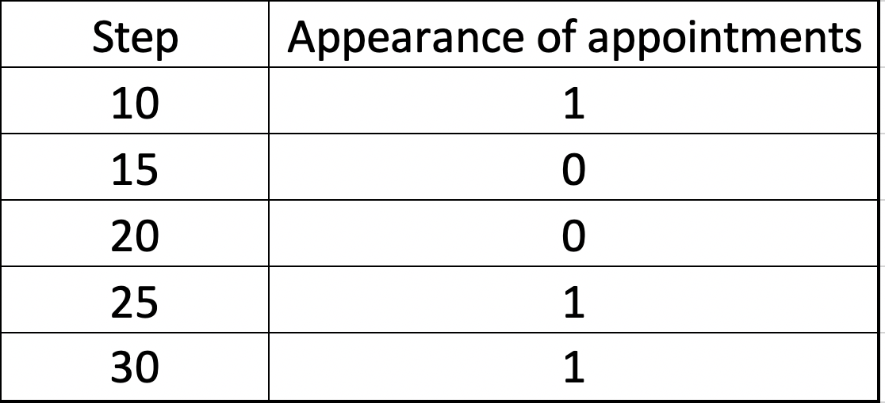

# Assignment problem

The essence of planning, is that
We need to find such appointments that we can't do without - that is, those that claim a single resource.
It is necessary to find in a destination matrix such line which contains only one unit, on this cell to execute assignments, and to reduce a matrix.
The same assumption can be made about a resource - if a resource claims one task - then it must be assigned to it. This is a search for a unit in a column, followed by the same purpose.
There are cases when the matrix is ​​not reduced to the end - there are no rows / columns in which only one unit - therefore, perform the appointment randomly - especially the result will not be affected, and then reduce the matrix.

It is known that a perfect matching in a bipartite graph may not be the only one. Therefore, if the graph is weighted, i.e. each edge is endowed with a weight, then it is natural to pose the problem of finding a matching with the highest or lowest weight. The possibility of practical application of the solution to this problem is obvious.

The task of this laboratory work was to determine the probability of occurrence of mandatory appointments when changing the occupancy of the matrix "1" connectivity from 1% to 100% for a given dimension from 10 to 30 with step 5.

### Algorithm
The algorithm is based on the theory of alternating chains by J. Petersen.

**Example Matrix**

**Step 1)** Subtract the minimum element from each line

**Result Matrix**

**Step 2)** We represent a bipartite graph in which the edges correspond to zero elements of the matrix A′

**Step 3)** Consider any maximum matching in this graph. Select the corresponding edges

**Step 4)** There is no alternating chain from X to Y. Therefore, this matching is the largest. Let's select the sets of vertices that are not included in the matching. This is Xm = {x₄}, Ym = {y₄}. Let's compose the sets of vertices that are included in the chains connecting Xm and X:

**X₀ = {x₂, x₄}, Y₀ = {y₁}**

**Step 5)** Let's transform the matrix A₀. Let us find the minimum element in the rows with the numbers of elements of the set X₀ and columns with the numbers of the elements of the set Y \ Y₀, i.e. in the matrix

**Step 6)** The minimum element is 3. Subtract 3 from rows 2 and 4 and add 3 to column 1.

**Result Matrix**

**Corresponding graph**

**The matching is now perfect**

**Step 7)** the sets Xm and Ym are empty; therefore, the problem is solved. Thus, choosing the elements of the original matrix A with the numbers of the edges of the obtained matching, we find the smallest costs:

**Σ = a₁₃ + a₂₁ + a₃₂ + a₄₄ = 1 + 1 + 1 + 4 = 7**

### Calculating probability

Next, we need to determine the probability of occurrence of mandatory appointments when changing the occupancy of the matrix "1" connectivity from 1% to 100% for a given dimension from 10 to 30 with step 5.

Determine if assignments appear for each step

1 - appear

0 - do not appear

**Calculating probability**

We see that the probabilitywe see that the probability is **60%**
