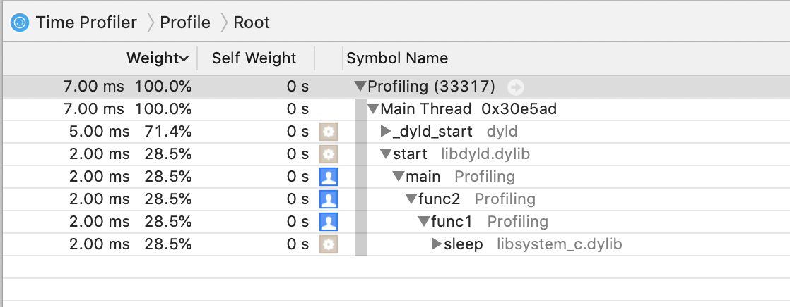
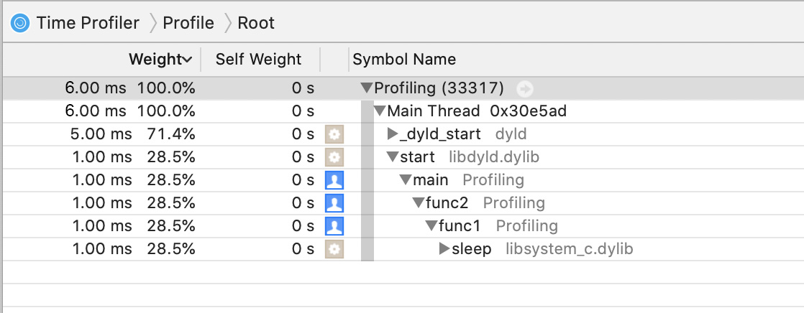

#  Profiling
## Condition
```

#include<stdio.h>

void new_func1(void);

int func1(int a, int b)
{
    int res = 0
    for(int i = 0; i < 10; i++)
    {
        sleep(1);
        if(i>8)
            res = resultOfSum(a, b);
        if(res > 0)
            return res;
    }
    return res;
}
int func2(int a, int b)
{
    int res = 0;
    for(int i = 0; i < 10; i++)
    {
        int res = func1(a, b);
        if(res > 0)
            return res;
    }

    return;
}
int resultOfSum(int a, int b)
{
    return a+b;
}

int main(void)
{
    func2(51, 110);

    return 0;
}

```
### Profiling result



## Solution for optimization
```

#include <stdio.h>
#include <unistd.h>

    int resultOfSum(int a, int b)
    {
        return a+b;
    }

    int func1(int a, int b)
    {
        int res = 0;
        sleep(1);
        res = resultOfSum(a, b);
        return res;
    }

    int func2(int a, int b)
    {
        int res = func1(a, b);
        return res;
    }

int main(void)
{
    func2(51, 110);
    return 0;
}

```
### Profiling result after optimization



## Conclusion

After optimization, we see that the execution time of functions has decreased by 2 times.

